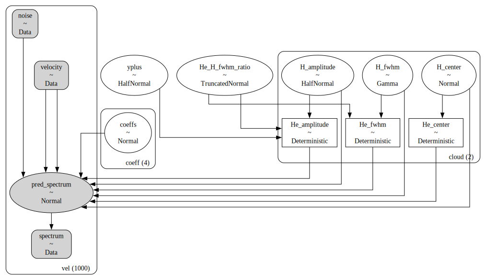

# mcmc_yplus <!-- omit in toc -->
A Bayesian model to infer helium abundances from radio recombination line (RRL) spectra.

`mcmc_yplus` fits a cloud-based model of ionized gas to RRL spectra.

- [Installation](#installation)
- [Model](#model)
- [Algorithms](#algorithms)
  - [Posterior Sampling: Variational Inference](#posterior-sampling-variational-inference)
  - [Posterior Sampling: MCMC](#posterior-sampling-mcmc)
  - [Posterior Clustering: Gaussian Mixture Models](#posterior-clustering-gaussian-mixture-models)
  - [Optimization](#optimization)
- [Syntax \& Examples](#syntax--examples)
- [Issues and Contributing](#issues-and-contributing)
- [License and Copyright](#license-and-copyright)


# Installation
Preferred: install in a `conda` virtual environment:
```
conda env create -f environment.yml
conda activate mcmc_yplus
pip install .
```

Alternatively:
```
python setup.py install
```

If you wish to contribute to `mcmc_yplus`, then you may wish to install additional dependencies and install `mcmc_yplus` as an "editable" package:
```
conda env create -f environment-dev.yml
conda activate mcmc_yplus-dev
pip install -e .
```

# Model

`mcmc_yplus` assumes that the RRL emission can be decomposed into a series of Gaussian components where the helium abundance `yplus` and the helium-to-hydrogen line-width ratio `He_H_fwhm_ratio` are assumed constant across all components. Furthermore, we assume that the helium line is fixed -122.15 km/s from the hydrogen line. The following diagram demonstrates the relationship between the free parameters (empty ellipses), deterministic quantities (rectangles), model predictions (filled ellipses), and observations (filled, round rectangles). The `cloud (2)` and `coeff(4)` sub-clusters represent the parameter groups for this two-cloud (`n_cloud=2`), 3rd order polynomial baseline (`baseline_degree=3`) model. The `vel (1000)` sub-cluster represents the spectral data. The subsequent tables describe the model parameters in more detail.



| Observations | Data                             | Units    | Dimension | Comment                |
| :----------- | :------------------------------- | :------- | :-------- | :--------------------- |
| `velocity`   | Velocity axis                    | `km s-1` | `vel`     |                        |
| `noise`      | Channel-dependent spectral noise | `K`      | `vel`     | Brightness temperature |
| `spectrum`   | RRL spectrum                     | `K`      | `vel`     | Brightness temperature |

| Free Parameter<br>`variable` | Quantity                 | Units    | Dimension | Prior, where<br>$(p_0, p_1, ...)$ = `prior_{variable}`                 | Default<br>`prior_{variable}` |
| :--------------------------- | :----------------------- | :------- | :-------: | ---------------------------------------------------------------------- |
| `H_amplitude`                | H RRL amplitude          | `K`      |  `cloud`  | $T_{\rm H} \sim {\rm HalfNormal}(\sigma=p_0)$                          | `[100.0]`                     |
| `H_center`                   | H RRL center velocity    | `km s-1` |  `cloud`  | $V_{\rm H} \sim {\rm Normal}(\mu=p_0, \sigma=p_1)$                     | `[0.0, 10.0]`                 |
| `H_center`                   | H RRL center velocity    | `km s-1` |  `cloud`  | $V_{\rm H} \sim {\rm Normal}(\mu=p_0, \sigma=p_1)$                     | `[0.0, 10.0]`                 |
| `H_fwhm`                     | H RRL FWHM line width    | `km s-1` |  `cloud`  | $\Delta V_{\rm H} \sim {\rm HalfNormal}(\sigma=p_0)$                   | `[20.0]`                      |
| `yplus`                      | Helium abundance         |          |           | $y^+ \sim {\rm HalfNormal}(\sigma=p_0)$                                | `[0.1]`                       |
| `He_H_fwhm_ratio`            | He-to-H line width ratio |          |           | $\Delta V_{\rm He}/\Delta V_{\rm H} \sim {\rm HalfNormal}(\sigma=p_0)$ | `[1.0]`                       |

| Deterministic Quantity<br>(dimension `cloud`) | Quantity               | Units    | Relationship                                                                |
| :-------------------------------------------- | :--------------------- | :------- | :-------------------------------------------------------------------------- |
| `He_amplitude`                                | He RRL amplitude       | `K`      | $T_{\rm He} = T_{\rm H} y^+/(\Delta V_{\rm He}/\Delta V_{\rm H})$           |
| `He_center`                                   | He RRL center velocity | `km s-1` | $V_{\rm He} = V_{\rm H} - 122.15$                                           |
| `He_fwhm`                                     | He RRL FWHM line width | `km s-1` | $\Delta V_{\rm He} = \Delta V_{\rm H} (\Delta V_{\rm He}/\Delta V_{\rm H})$ |

# Algorithms

## Posterior Sampling: Variational Inference

`mcmc_yplus` can sample from an approximation of model posterior distribution using [variational inference (VI)](https://www.pymc.io/projects/examples/en/latest/variational_inference/variational_api_quickstart.html). The benefit of VI is that it is fast, but the downside is that it often fails to capture complex posterior topologies. We recommend only using VI for quick model tests or MCMC initialization. Draw posterior samples using VI via `model.fit()`.

## Posterior Sampling: MCMC

`mcmc_yplus` can also use MCMC to sample the posterior distribution. MCMC sampling tends to be much slower but also more accurate. Draw posterior samples using MCMC via `model.sample()`.

## Posterior Clustering: Gaussian Mixture Models

Assuming that we have drawn posterior samples via MCMC using multiple independent Markov chains, then it is possible that each chain disagrees on the order of clouds. This is known as the labeling degeneracy. For optically thin radiative transfer, the order of clouds along the line-of-sight is arbitrary so each chain may converge to a different label order.

It is also possible that the model solution is degenerate, the posterior distribution is strongly multi-modal, and each chain converges to different, unique solutions.

`mcmc_yplus` uses Gaussian Mixture Models (GMMs) to break the labeling degeneracy and identify unique solutions. After sampling, execute `model.solve()` to fit a GMM to the posterior samples of each chain individually. Unique solutions are identified by discrepant GMM fits, and we break the labeling degeneracy by adopting the most common cloud order amongst chains.

## Optimization

`mcmc_yplus` can optimize the number of clouds in addition to the other model parameters. The `Optimize` class will use VI to estimate the preferred number of clouds, and then sample the "best" model with MCMC.

# Syntax & Examples

See the various notebooks under [examples](https://github.com/tvwenger/mcmc_yplus/tree/main/examples).

# Issues and Contributing

Anyone is welcome to submit issues or contribute to the development
of this software via [Github](https://github.com/tvwenger/mcmc_yplus).

# License and Copyright

Copyright (c) 2023-2024 Trey Wenger

GNU General Public License v3 (GNU GPLv3)

This program is free software: you can redistribute it and/or modify
it under the terms of the GNU General Public License as published
by the Free Software Foundation, either version 3 of the License,
or (at your option) any later version.

This program is distributed in the hope that it will be useful,
but WITHOUT ANY WARRANTY; without even the implied warranty of
MERCHANTABILITY or FITNESS FOR A PARTICULAR PURPOSE.  See the
GNU General Public License for more details.

You should have received a copy of the GNU General Public License
along with this program.  If not, see <http://www.gnu.org/licenses/>.

